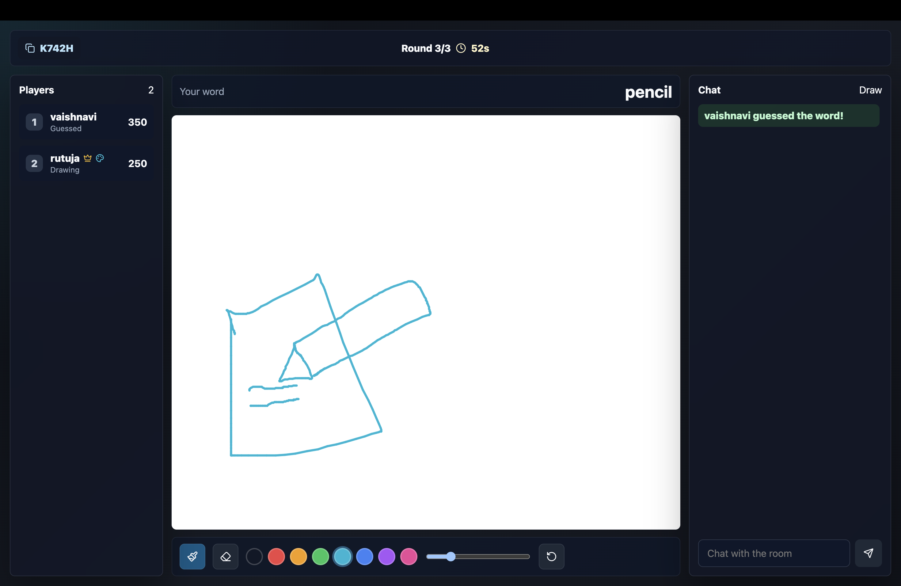

# Scribble

Scribble is a real-time multiplayer drawing and guessing game where players sketch words, make guesses, and compete to achieve the highest score.



## Features

- Real-time drawing canvas
- Multiplayer game rooms
- Live chat and word guessing
- Score tracking
- Responsive user interface

## Tech Stack

| Frontend | Backend | Database |
|----------|----------|----------|
| Next.js, React, Tailwind CSS | Node.js, Express.js, Socket.IO | MongoDB |

## Installation

```bash
git clone https://github.com/rutuja2005byte/Scribble.git
cd Scribble
npm install
npm run dev
